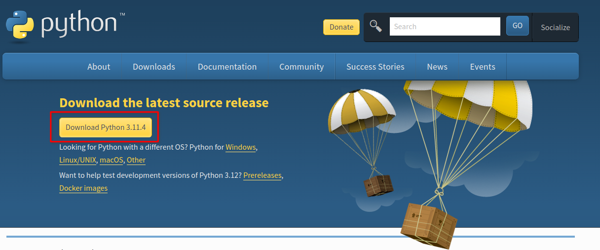

# Minesweeper

## Demonstration

https://github.com/LunaTMT/Minesweeper/assets/44672093/b88e8e33-17c8-4797-8ab1-a556ead8158d

### Menu

https://github.com/LunaTMT/Minesweeper/assets/44672093/227fc63a-d8e5-422f-8473-d90fe67659de

### Win

https://github.com/LunaTMT/Minesweeper/assets/44672093/651a22be-6b44-45c4-be6a-8d933d1bdf90

### Lose

https://github.com/LunaTMT/Minesweeper/assets/44672093/c9293753-1711-4a2b-94ae-6c55a685b682

### Easy

### Medium

### Hard

## Installation & Setup

* To run this program please make sure you have [python](https://www.python.org/downloads/) installed on your system.

<figure><figcaption></figcaption></figure>

* Download the ZIP folder from the GitHub repository.

<figure><figcaption></figcaption></figure>

* Extract the contents of the zip folder into another folder on your desktop. You can do this by highlghting all the files in the red box and dropping them into the new folder.

<figure><figcaption></figcaption></figure>

* Once the contents of the zip folder are in the new folder, right click _main.py_ and you should see an option noted _'Open with IDLE.'_

<figure><figcaption></figcaption></figure>

If you do not see this you most likely do not have python installed properly on your system. If so, please refer back to the beginning. If you'd like to know more what IDLE is please refer to Real Python's [small introduciton](https://realpython.com/python-idle/#what-is-python-idle) on the topic.

* Once inside the _main.py_ file in your python IDE you can either:
  1. Click _Run_ on the top tab and then click _Run Module_, or
  2. Simply press _F5_

<figure><figcaption></figcaption></figure>

* The program should run and you can now play minesweeper! Enjoy :)

<figure><figcaption></figcaption></figure>

### Personal Overview

The base game for this project took 2 days to make and I'm quite surprised how quickly I was able to accomplish this project. The hardest part of the game was the sweeping algorithm, however, I managed to get this all sorted in an evening. I think the past 3 months of leetcode questions has really helped me get to grips with algorithmic problems and how to go about solving them.

I'd like to give a personal thanks to [fullptr](https://www.reddit.com/user/fullptr/) who gave me some really solid advise about my over usage of classes in my [previous reddit post](https://www.reddit.com/r/Python/comments/157beuo/my\_third\_project/), as well other advise that really made this project much simpler to make.

The next two days was followed up by refactoring, comments and making the game more presentable.

### Future Projects

* ~~2048~~
* Doodle Jump
* Tetris
